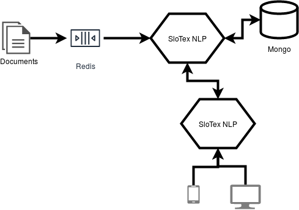

Is a main SloTex NLP project, which joins all project modules and also include
project user and developer documentation, project's web page, and all other
necessary info to use or contribute to SloTex NLP in your own environment. 

[](https://travis-ci.com/github/MediusInc/slotex-nlp)
[]( https://github.com/MediusInc/slotex-nlp/blob/master/LICENSE.md)
[](https://join.slack.com/t/pkp2019-slotex/shared_invite/enQtNzkwNTk5MDMyOTc2LTNhOTQ0MTU3ZDMzMDM2NDRhYTRlNWRkOWRmZTk0N2YzNmExNDliYTU1NGI4NWFjNjFhNTFkNTcyNzhlZGIzZmU)



```
The scheme above represents how the different elements of the project interact
with eachother.
```

SloTex project is designed as microservice-based project, which tries to
facilitate and make robust handling of incoming data with Redis server, and
stores processed data in MongoDB. We developed a front-end application for
handling data and training process [SloTex NLP
web](https://github.com/MediusInc/slotex-nlp-web) project, and the back-end
application [SloTex NLP core](https://github.com/MediusInc/slotex-nlp-core)
with exposed RESTFul web services developed with Spring Boot
framework. 

For testing purposes we also developed a Bash client [SloTex NLP
pwc](https://github.com/MediusInc/slotex-nlp-pwc), which allows us to send
multiple documents in `.txt` or `.doc` format to the Redis queue and allows us
to initialize the training process and also other test scenario's. 

## Quick run using docker

Here we provide step by step simple guide, how you can run the project using
Docker and docker-compose, for quick start on local computer. 


### Running Docker image with docker-compose

Before running docker image locally, we expect that you set dependant variables
and build image first. 

```
./run-in-docker.sh 
```
Now you could visit app by visiting `http://localhost:8080` in your favorite
browser.


## Building documentation

To build a html documentation please run the following:

```
 mvn clean package
```

The docs are generated at: docs/generated-html/slotex-nlp.html

## Project Funding

|   |   |   |
| --- | --- | --- |

**This project was founded by Republic of Slovenia and European union from European social found.**

